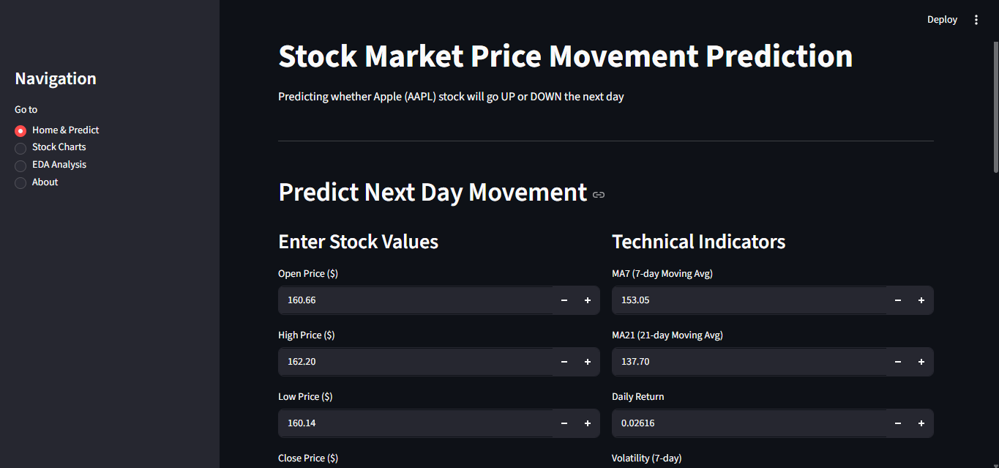
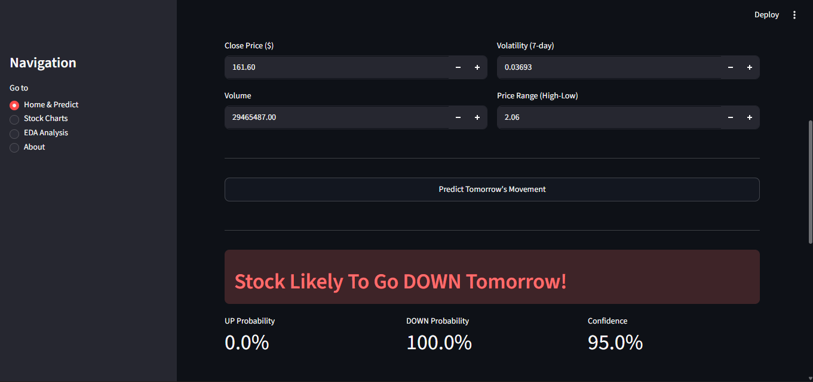
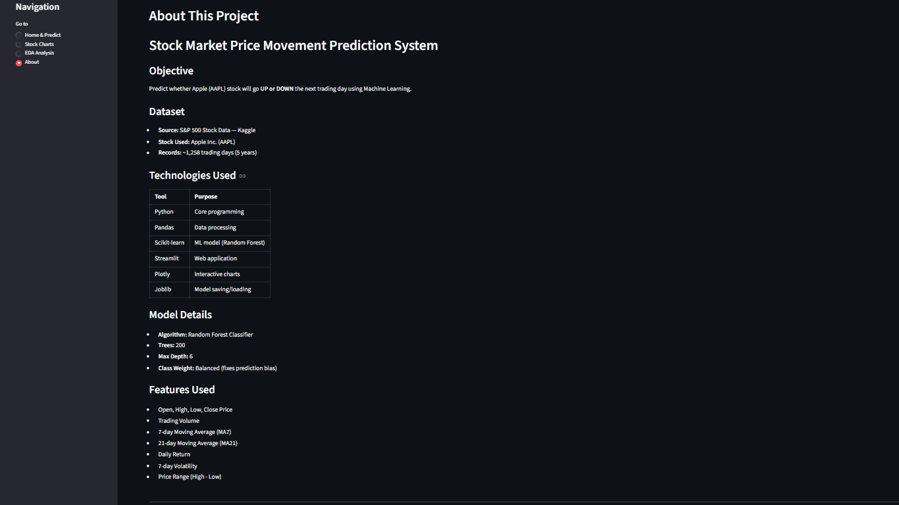

## Workflow

Dataset Collection
↓
 
Data Cleaning
↓

Exploratory Data Analysis (EDA)
↓

Feature Engineering
↓

Model Training
↓

Model Evaluation
↓

Model Saving
↓

Streamlit Application
↓

Prediction Generation

## Model Performance

Model Used:
- Random Forest Classifier

Accuracy Achieved:
- 46.77%

Evaluation Metrics:
- Accuracy Score

Note:
Stock market prediction is highly challenging due to market volatility and uncertainty. The objective of this project is to demonstrate the complete Machine Learning workflow from data preprocessing to deployment.

## Skills Demonstrated

- Python Programming
- Data Cleaning and Preprocessing
- Exploratory Data Analysis (EDA)
- Feature Engineering
- Machine Learning
- Model Evaluation
- Streamlit Development
- GitHub Version Control

## Future Enhancements

- Support multiple stocks
- Real-time stock data integration
- Advanced indicators such as RSI and MACD
- Deep Learning models (LSTM)
- Portfolio recommendation system
- Cloud deployment

------

# Project Screenshots

## Home Page

---

## Prediction Result

---

## AAPL Historical Stock Chart
 1.png)

---

## Trading Volume (Stock Chart)
2.png)

---

## Daily Returns (Stock Chart)
3.png)

---

## Close Price Distribution & Correlation Heatmap (EDA Analysis)
.png)

---

## Exploratory Data Analysis (EDA Analysis)
.png)

---

## UP vs DOWN Days Distribution & Volatility

---

## About Page

